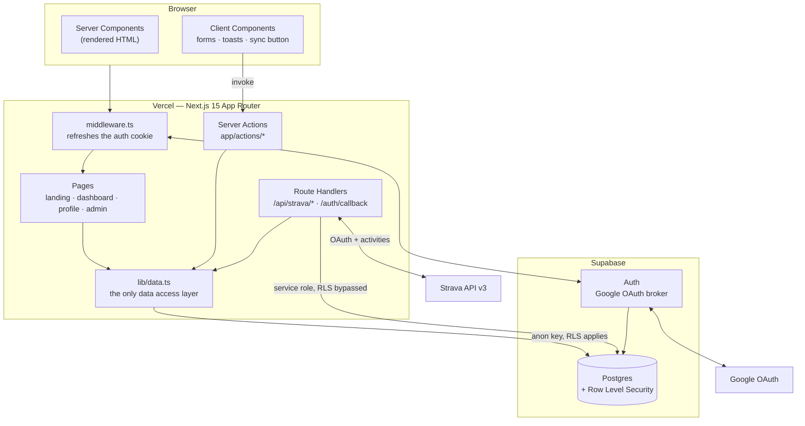
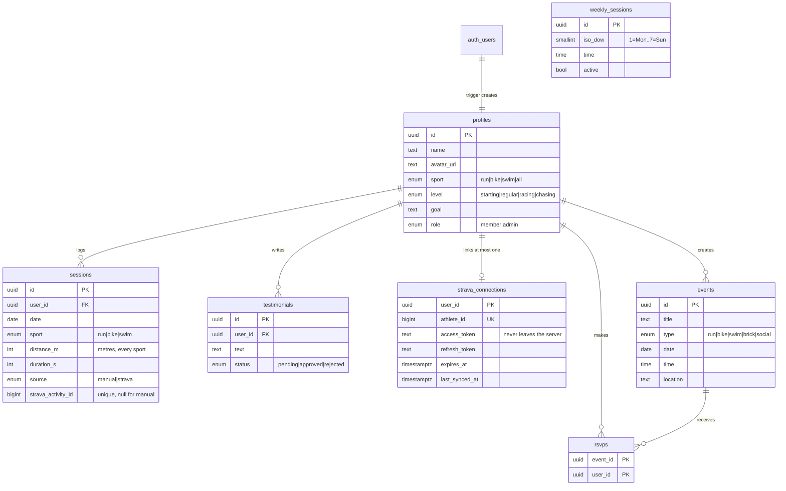
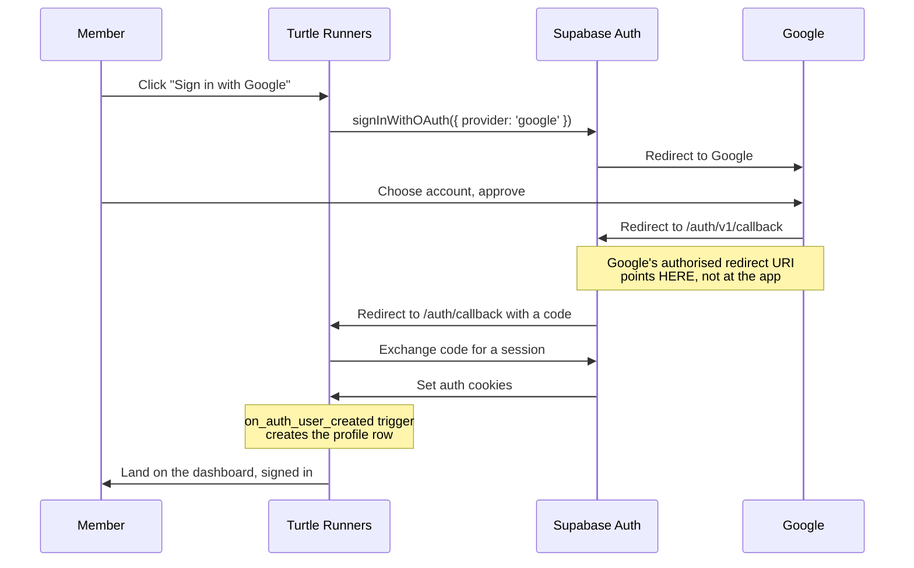
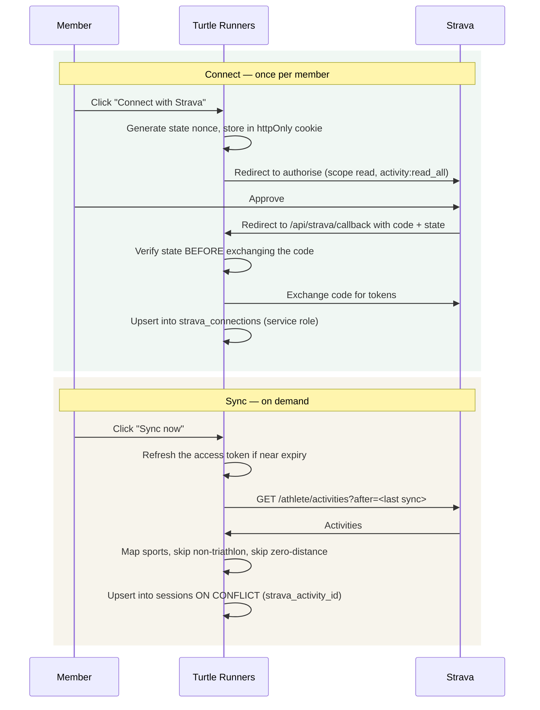
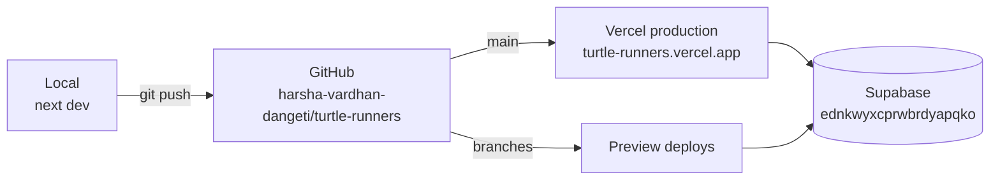

# Turtle Runners — architecture and features

A triathlon club web app for [Durgam Cheruvu](https://maps.google.com/?q=Durgam+Cheruvu+Lake+Front+Park), Hyderabad.
Members see the week's sessions, log their training, RSVP to events, and optionally
link Strava so their runs, rides and swims import automatically.

**Live:** https://turtle-runners.vercel.app
**Stack:** Next.js 15 (App Router) · React 19 · Supabase (Postgres + Auth) · Tailwind · Vercel

---

## Contents

1. [System architecture](#system-architecture)
2. [Features](#features)
3. [Data model](#data-model)
4. [Security model](#security-model)
5. [Authentication flow](#authentication-flow)
6. [Strava integration](#strava-integration)
7. [Demo mode](#demo-mode)
8. [Code layout](#code-layout)
9. [Deployment](#deployment)
10. [Known limits](#known-limits)

---

## System architecture

Everything above the data layer is source-agnostic. Pages and server actions never
import Supabase directly — they call `lib/data.ts`, which decides whether to hit
Postgres or an in-memory fixture store. That one rule is what makes demo mode possible
without a parallel codebase.



### The two database clients

This is the most important distinction in the codebase.

| Client | Key | RLS | Used by | File |
|---|---|---|---|---|
| Server client | anon | **enforced** | Everything | `lib/supabase/server.ts` |
| Browser client | anon | **enforced** | Auth handoff | `lib/supabase/client.ts` |
| Admin client | service role | **bypassed** | Strava token access only | `lib/supabase/admin.ts` |

The admin client exists for exactly one reason, explained under
[Security model](#security-model). It carries a `server-only` import so that
referencing it from a client component is a build error rather than a leak.

---

## Features

### Public landing page

Renders for signed-out visitors, so it must work with no session.

- **Hero** with the club's three-line identity and an animated route line
- **Ticker** of the week's recurring sessions
- **Next session card** with a live countdown and RSVP
- **Upcoming events** pulled from the events table
- **Weekly schedule** — falls back to a built-in default when the table is empty
- **Training grounds** — three routes with self-drawing elevation profiles, in a
  sticky pinned section
- **Club stats band** — aggregate distance across all members, counted from a view
  that exposes totals without exposing individuals
- **Voices** — approved member testimonials, with a submission form

### Member dashboard

- **Weekly volume rings** for run, bike and swim against targets derived from the
  member's self-declared level
- **Streak** — consecutive weeks with at least one logged session
- **Session log** with personal-best badges computed at read time
- **Manual session logging** — swims entered in metres, runs and rides in kilometres,
  stored as metres throughout so totals are a single sum
- **Strava card** — connect, sync, disconnect, plus year-to-date totals, recent
  activities and gear mileage
- **Bib card** — the member's number, sport and goal race
- **RSVP list** for upcoming events

### Admin area

Gated on `profiles.role = 'admin'`, enforced in the database rather than the UI.

- **Overview** — members, admins, weekly distance, attendance chart
- **Members** — search and promote or demote
- **Events** — create, edit and delete, with a Google Places location picker
- **Weekly schedule** — edit the club's recurring rhythm
- **Testimonials** — approve or reject submissions
- **Training grounds** — the home page route cards. Elevation profiles are
  measured automatically: the admin drops a few points along the route and
  Open-Meteo's keyless elevation service is sampled along that path, then
  min-max normalised to the 0-1 range the SVG line expects

### Motion system

CSS-first, with no animation library.

- Scroll-scrubbed reveals driven by native view timelines, falling back to an
  `IntersectionObserver` where unsupported
- Cross-page fade via `app/template.tsx`
- Header that condenses on scroll using a scroll timeline
- Every animation gated behind `prefers-reduced-motion`

---

## Data model

Seven tables and three views. Distances are metres everywhere; times are seconds.



### Views

Three views expose aggregates to signed-out visitors without exposing the rows behind
them: `public_testimonials`, `public_event_rsvp_counts` and `public_week_volume`. The
landing page's club stats come from the last of these, which is why total distance is
public while individual training is not.

---

## Security model

Row Level Security is the actual protection, not any check in application code. Every
table has RLS enabled. Policies are keyed to `auth.uid()`, and admin checks go through
a `security definer` helper so that a policy on `profiles` can ask "is this an admin?"
without recursing into its own policy.

### The deliberate exception

`strava_connections` has **RLS enabled and no policies at all**.

That is not an oversight. Elsewhere a member may read their own rows, because the
browser holds the anon key and RLS is what keeps members apart. That rule is wrong for
this table: its rows hold live Strava bearer tokens, so a "read your own connection"
policy would hand a working credential to any script on the page.

With RLS on and zero policies, the table is unreachable via the anon key. Only the
service role client can touch it, and that key never reaches the browser. One function,
`getStravaConnection()`, reads it on behalf of the UI, and it selects display columns
only — never the token columns.

### Role escalation

Roles are not self-service. The `profiles_guard_role` trigger rejects any update where
`role` changes and the caller is not already an admin.

> **Bootstrap note.** This means the *first* admin cannot be created by an update alone,
> because no admin exists to satisfy the check. The trigger has to be stepped around
> once, in a transaction:
>
> ```sql
> begin;
> alter table public.profiles disable trigger profiles_guard_role;
> update public.profiles set role = 'admin' where id = '<your-uuid>';
> alter table public.profiles enable trigger profiles_guard_role;
> commit;
> ```

---

## Authentication flow

The redirect goes to **Supabase**, not to this app. This is the single most common
setup mistake: the app is never Google's OAuth client, Supabase is.



`middleware.ts` refreshes the session cookie on every request. Without it, an expired
access token is never renewed for Server Components.

---

## Strava integration

### Two layers, often confused

**The application is one, and it belongs to the club.** The client ID and secret are
server-side configuration, set once. No member sees them or creates a Strava app.

**The connections are one per member.** `strava_connections.user_id` is the primary
key. Every member authorises under their own Strava account and gets their own tokens.
Thirty members means one application and thirty rows.

### Connect and sync



### Design decisions worth knowing

**Activities become ordinary sessions.** Imported activities are rows in `sessions`
with `source = 'strava'`. The streak, the volume rings and the club totals therefore
work without knowing where a session came from.

**Re-syncing is idempotent.** A unique index on `strava_activity_id` makes the upsert a
no-op for anything already imported. Without it, every sync would duplicate the
member's entire history. The index must be **plain, not partial** — Postgres will not
infer a partial index as an `ON CONFLICT` target, and the Supabase client cannot supply
the predicate. This was a real bug, fixed in migration `0005`.

**Only three sports import.** Run, ride and swim variants map to the club's sports.
Walks, hikes, yoga and gym work are skipped rather than defaulted, because they are not
triathlon volume and would distort the rings and the club total.

**Dates come from the athlete's local clock.** `start_date_local` is used directly.
Parsing it as UTC would push a 5:45am Hyderabad run onto the previous day.

**Token refresh is centralised.** Strava access tokens last about six hours, so refresh
is the normal path, not an edge case. One wrapper refreshes near expiry, retries once
on a 401, and turns a 429 into a readable message.

**Disconnect removes imports.** It deletes the connection and every session it created,
leaving hand-logged sessions untouched.

---

## Demo mode

Set `NEXT_PUBLIC_DEMO=true`, or simply leave the Supabase keys blank, and the whole app
runs on seeded in-memory fixtures with no database, no keys and no network. Google
sign-in becomes a member/admin picker, and Strava becomes a fixture connection with
fake activities.

This exists so the app can be demonstrated and developed offline. The store lives on
`globalThis` to survive hot reloads, and resets when the process recycles.

> **Careful:** demo mode fails *open*. With no Supabase keys the app serves fixtures
> rather than erroring, so a misconfigured production deploy looks healthy while
> showing invented data. Always set `NEXT_PUBLIC_DEMO=false` explicitly in production.

---

## Code layout

```
app/
  page.tsx              Landing page
  dashboard/            Member dashboard
  profile/              Profile editor
  admin/                Admin area (5 pages)
  actions/              8 server action modules
  api/strava/           OAuth connect + callback
  auth/callback/        Supabase session exchange
  template.tsx          Cross-page fade

components/
  landing/  (14)        Hero, schedule, stats, testimonials
  dashboard/ (8)        Rings, session table, Strava cards
  admin/    (7)         Managers and charts
  ui/       (8)         Reveal, Drawer, Toast, ProgressRing
  auth/ nav/ brand/ profile/

lib/
  data.ts               THE data layer — nothing else imports Supabase
  stats.ts              Rings, streak, personal bests, formatting
  strava/               client · map · sync · types
  elevation.ts          keyless elevation profiles (Open-Meteo)
  supabase/             server · client · admin
  demo/                 fixtures · store · session · strava
  club.ts time.ts maps.ts places.ts env.ts action-result.ts

supabase/migrations/
  0001_init                    profiles, events, rsvps, testimonials, RLS
  0002_sessions_and_schedule   sessions + weekly schedule
  0003_session_locations       precise meeting points
  0004_strava                  connections table + session source columns
  0005_strava_upsert_fix       plain unique index for ON CONFLICT
  0006_training_grounds        admin-managed route cards + RLS
  0007_ground_waypoints        remembers the route a profile came from
```

**The one rule:** only `lib/data.ts` imports Supabase. Pages and actions call it and
stay unaware of whether they are talking to Postgres or fixtures.

---

## Deployment



### Environment variables

| Variable | Exposure | Source |
|---|---|---|
| `NEXT_PUBLIC_SUPABASE_URL` | Browser | Supabase → Settings → API |
| `NEXT_PUBLIC_SUPABASE_ANON_KEY` | Browser | Same. Safe: RLS protects the data, not secrecy |
| `NEXT_PUBLIC_SITE_URL` | Browser | The deployment's own domain |
| `NEXT_PUBLIC_DEMO` | Browser | `false` in production |
| `SUPABASE_SERVICE_ROLE_KEY` | **Server only** | Bypasses RLS. Never prefix with `NEXT_PUBLIC_` |
| `STRAVA_CLIENT_ID` | Server only | Strava API settings |
| `STRAVA_CLIENT_SECRET` | Server only | Strava API settings |

`VERCEL_URL` and `NODE_ENV` are supplied by the platform.

> **`NEXT_PUBLIC_` values are compiled into the bundle at build time.** Changing one in
> the dashboard does nothing until you redeploy. This is why first-time setup needs two
> deploys: the first tells you the domain, the second bakes it in.

---

## Known limits

**Strava caps connected athletes at 10** on the Standard Tier. Member eleven is refused
with `Limit of connected athletes exceeded`. Exceeding it requires Strava's Extended
Access Tier and a review. For a club roster this is the binding constraint, not the
subscription.

**Strava requires a paid subscription** on the account that owns the application.
Without it every API call returns `403 Application Status Inactive`, and the failure is
app-wide, not per member.

**Strava allows one callback domain per application.** Local development and production
cannot both work from a single app. Either switch the field when deploying, or register
a second application.

**Signed-out `/admin` throws** rather than showing a sign-in prompt, unlike `/dashboard`
which degrades gracefully. Cosmetic, but inconsistent.

**Personal bests are partly local.** Strava exposes no clean personal-records endpoint —
real segment records need a call per activity, which would exhaust the rate limit. So
records come from athlete stats (biggest ride, biggest climb) plus bests derived from
synced sessions.

**The project region is `ap-northeast-2` (Seoul).** Mumbai would be materially faster
for Hyderabad members. Region cannot be changed after creation.
